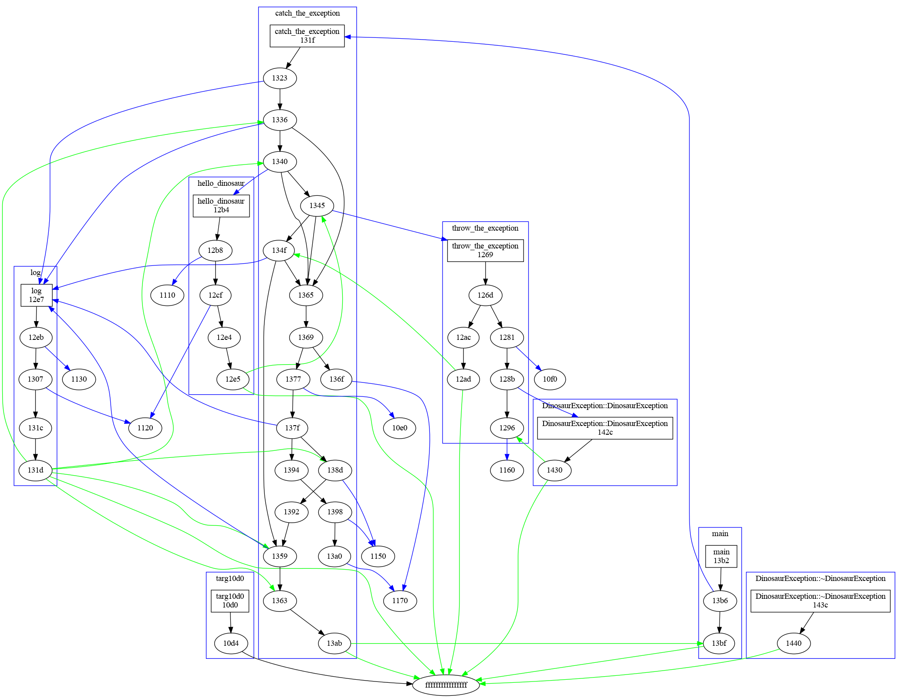
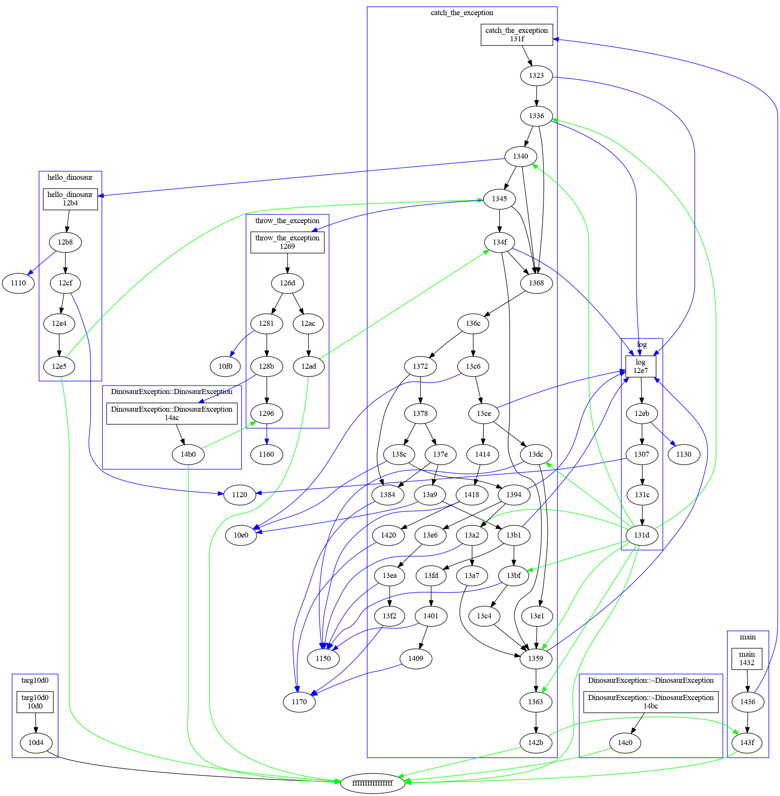
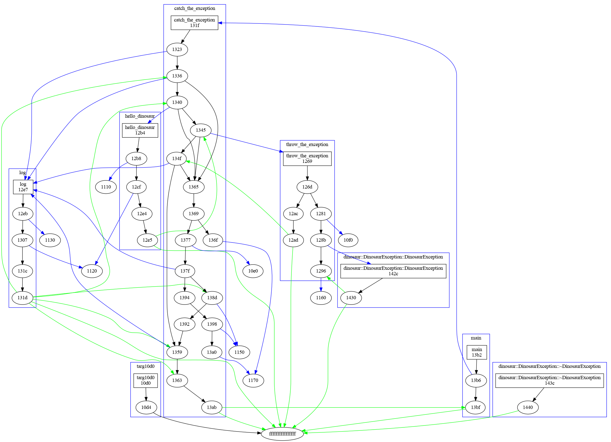
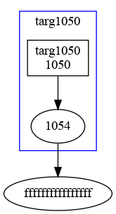

# Dyninst Call Tree

This is a small script to look at a Dyninst call tree for a library.
Build the container:

```bash
$ docker build -t tree .
```

And then shell inside and compile:

```bash
$ make
```

We can then generate .dot files for the different programs/libraries we've been looking at,

1. a simple exception-program with a DinosaurException
2. the same program with more types of animal exceptions
3. a main program that uses an exception library
4. the exception library

Here are those programs/libraries

```
../0-can-i-make-assembly/cpp/exception-program .
../1-can-i-find-exception-ids/exception-animals .
cp ../0-can-i-make-assembly/cpp/use-dinosaur .
cp ../0-can-i-make-assembly/cpp/libdinosaur-v1.so .
```

Done in this order:

```bash
./call_graph exception-program > exception-program.dot
./call_graph exception-animals > exception-animals.dot
./call_graph use-dinosaur > use-dinosaur.dot
./call_graph libdinosaur-v1.so > libdinosaur.dot
```

Then convert to png!

```bash
dot -Tpng exception-program.dot > exception-program.png
dot -Tpng exception-animals.dot > exception-animals.png
dot -Tpng use-dinosaur.dot > use-dinosaur.png
dot -Tpng libdinosaur.dot > libdinosaur.png
```

# Results

## Exception Program

This is the simplest of the examples - a single program with a DinosaurException
defined within it, and the exception thrown.




## Exception Animals

This is the same, but we have two added exceptions, `AlligatorException` and `MooseException`.



## Use Dinosaur

This is a simple program that uses the DinosaurException from an external library.




## Exception Library

and here is the library.



